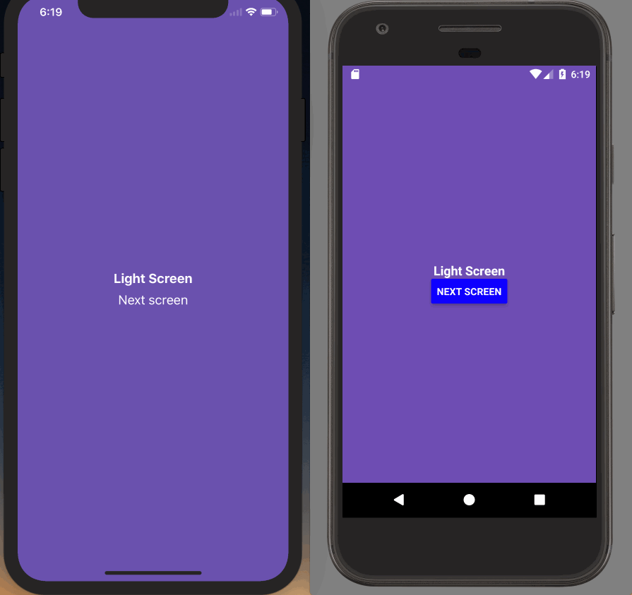

- [ ] iOS StackNavigator
- [ ] Android StackNavigator
- [ ] iOS TabNavigator
- [ ] Android TabNavigator
- [ ] iOS Drawer Navigator
- [ ] Android Drawer Navigator

If you don't have a navigation bar, or your navigation bar changes color based on the route, you'll want to ensure that the correct color is used for the content.

## StackNavigator and DrawerNavigator

This is a simple task when using the StackNavigator or DrawerNavigator. You can simply render the `StatusBar` component, which is exposed by React Native, and set your config.

```javascript
const Screen1 = ({ navigation }) => (
  <SafeAreaView style={[styles.container, { backgroundColor: '#6a51ae' }]}>
    <StatusBar
      barStyle="light-content"
      backgroundColor="#6a51ae"
    />
    <Text style={[styles.paragraph, { color: '#fff' }]}>
      Light Screen
    </Text>
    <Button
      title="Next screen"
      onPress={() => navigation.navigate('Screen2')}
      color="#fff"
    />
  </SafeAreaView>
);

const Screen2 = ({ navigation }) => (
  <SafeAreaView style={[styles.container, { backgroundColor: '#ecf0f1' }]}>
    <StatusBar
      barStyle="dark-content"
      backgroundColor="#ecf0f1"
    />
    <Text style={styles.paragraph}>
      Dark Screen
    </Text>
    <Button
      title="Next screen"
      onPress={() => navigation.navigate('Screen1')}
    />
  </SafeAreaView>
);
```

```javascript
export default StackNavigator({
  Screen1: {
    screen: Screen1,
  },
  Screen2: {
    screen: Screen2,
  },
}, {
  headerMode: 'none',
});
```



```javascript
export default DrawerNavigator({
  Screen1: {
    screen: Screen1,
  },
  Screen2: {
    screen: Screen2,
  },
});
```


## TabNavigator

If you're using a TabNavigator it's a bit more complex because the screens on all of your tabs are rendered at once - that means that the last `StatusBar` config you set will be used (likely on the final tab of your tab navigator, not what the user is seeing).

To fix this we'll leverage the `tabBarOnPress` navigationOption and, using `StatusBar`'s imperative API, change the `StatusBar` configuration each time the active tab changes.

```javascript
const isAndroid = Platform.OS === 'android';
export default TabNavigator({
  Screen1: {
    screen: Screen1,
    navigationOptions: {
      tabBarOnPress: ({ previousScene, scene, jumpToIndex }) => {
        // TODO: This doesn't handle the initial render because the second screen renders last. What to do?
        StatusBar.setBarStyle('light-content');
        isAndroid && StatusBar.setBackgroundColor('#6a51ae');
        jumpToIndex(scene.index);
      },
    },
  },
  Screen2: {
    screen: Screen2,
    navigationOptions: {
      tabBarOnPress: ({ previousScene, scene, jumpToIndex }) => {
        StatusBar.setBarStyle('dark-content');
        isAndroid && StatusBar.setBackgroundColor('#ecf0f1');
        jumpToIndex(scene.index);
      },
    },
  },
});

```

TODO: Add gif of tab on iOS and Android

The code used for these demos is available as a [Snack](https://snack.expo.io/r1iuFP6Ez).
